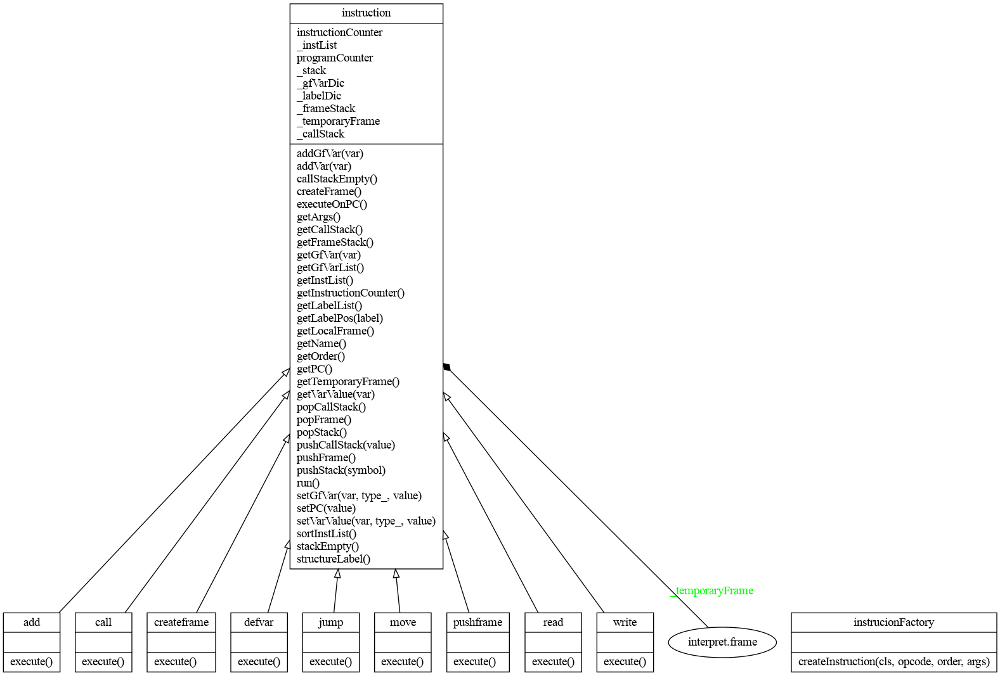

# Implementační dokumentace k 2. úloze do IPP 2023
## Jméno a příjmení: Jakub Lukáš
## Login: xlukas18

## Popis základní funkcionality
Skript interpret.py je napsaný v jazyce python3.10. Skript bere na vstupu xml reprezentaci kódu v jazyce IPPcode23. Zpracuje vstup a vytvoří jeho interní reprezentaci. Následně se provede interpretace kódu a výsledky se vypíšou na standartní výstup.

## Použití
Skript je spouštěn příkazem `python3.10 interpret.py [--help] [--source=file] [--input=file]`. Argumenty jsou nepovinné. Argument `--help` vypíše nápovědu a skript se ukončí. Argument `--source=file` nastaví soubor `file` jako vstupní kód. Argument `--input=file` nastaví soubor `file` jako vstup programu. Když není zadán argument `--source`, nebo `--input`, je místo něj použit standartní vstup. Skript však musí být spuštěn s alepoń jedním argumentem.

## Použité knihovny
- sys - pro ukončení programu s chybovým kódem
- xml.etree.ElementTree - pro práci s xml
- argparse - pro práci s argumenty příkazové řádky

## Objektový návrh a Implementace
Skript využívá k interpretaci v podstatě tři třídy. Třída `Instruction` reprezentuje instrukci v kódu a má data potřebné pro běh interpretace jako seznam instrukcí, programový čítač, slovník globálních proměnných, datový zásobník, zásobník rámců, dočasný rámec, nebo slovník návěští. Dále taky třída vlastní metody pro manipulaci s těmito třídními atributy a metody pro vykonávání jednotlivých instrukcí. Třída `Frame` reprezentuje rámec a každá instance má svůj slovník proměnných. Dále má taky metody pro manipulaci s proměnnými v rámci. Skript definuje specifickou třídu pro každou instrukci (např. createframe, move, ...), tyto třídy dědí od třídy `instruction`. Každá má svoji metodu execute, která při zavolání vykoná instrukci. Před začátkem interpretace jsou ze vstupu načítány instrukce a podle jejich operačního kódu se pomocí továrny `InstructionFactory` vytvoří instance tříd, které dědí od třídy `Instruction` (createframe, move, ...). Při vytvoření instance třídy této instrukce je vytvořena i její nadřazená super třída `Instruction` a jsou ji předány argumenty, operační kód opcode a pořadí v kódu order. Zároveň při vytvoření instance `Instruciton` se objekt, co ji vytvořil uloží do seznamu _instList, který vlastní třída `Instruction`. Po načtení všech instrukcí jsou v _instList instrukce seřazeny podle jejich pořadí order. Před interpretací jsou v seznamu instrukcí hledány návěští a jejich jméno a pozice v kódu jsou ukládány do slovníku _labelDic. Interpretace začíná spuštěním metody run u poslední načtené instrukce. Ta v cyklu volá metodu executeOnPC která vezme instrukci ze seznamu instrukcí na indexu programového čítače a zavolá její metodu execute. Výjimkou jsou skokové instrukce a instrukce operující s rámci, ty se detekují už v metodě run a jsou vykonány přímo v ní. Jejich funkčnost mimo třídu `Inastruciton` se mi nepovedla naimplementovat. Metody execute u skokových instrukcí místo vykonání skoku vrací hodnotu True, když má proběhnout skok, ten je proveden v metodě executeOnPC změnou programového čítače. Načítání vstupní xml reprezentace a kontrola její správnosti je implementována v hlavním bloku kódu main. Probýhá zde i načítání argumentů a incializování instrukcí.
### Proměnné
Proměnné jsou ukádány do slovníků. Ve slovníku je u prvků klíčem jméno proměnné a jako hodnota ntice (typ, hodnota). Takže například proměnná GF@var1 s hodnotou string@ahoj by byla uložena takto: {"var1": ("string", "ahoj")}. Pro globální rámec je slovník přímo jako atribut třídy `Instruction`. Pro ostatní rámce je využita třída `Frame`.
### Graf tříd
Do grafu jsem úmyslně nezahrnul třídy všech instrukcí kvuli přehlednosti. Nic méně vynechané třídy jsou kromě jména identické k zahrnutým třídám jako `defvar`, `move`, `jump`, nebo `pushframe`
